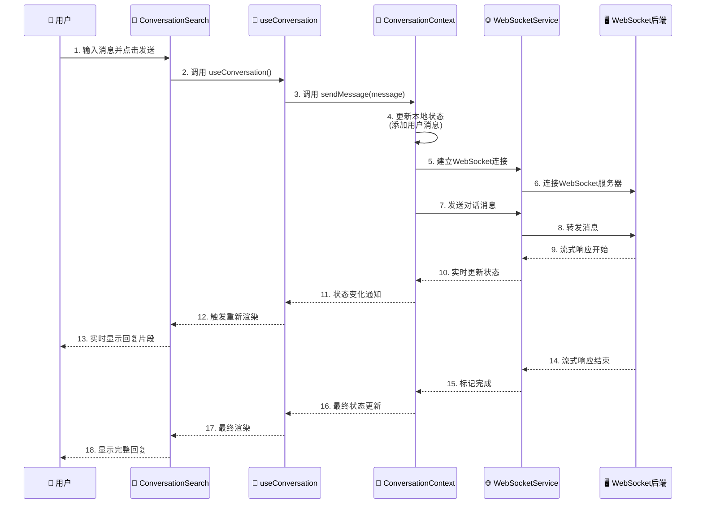
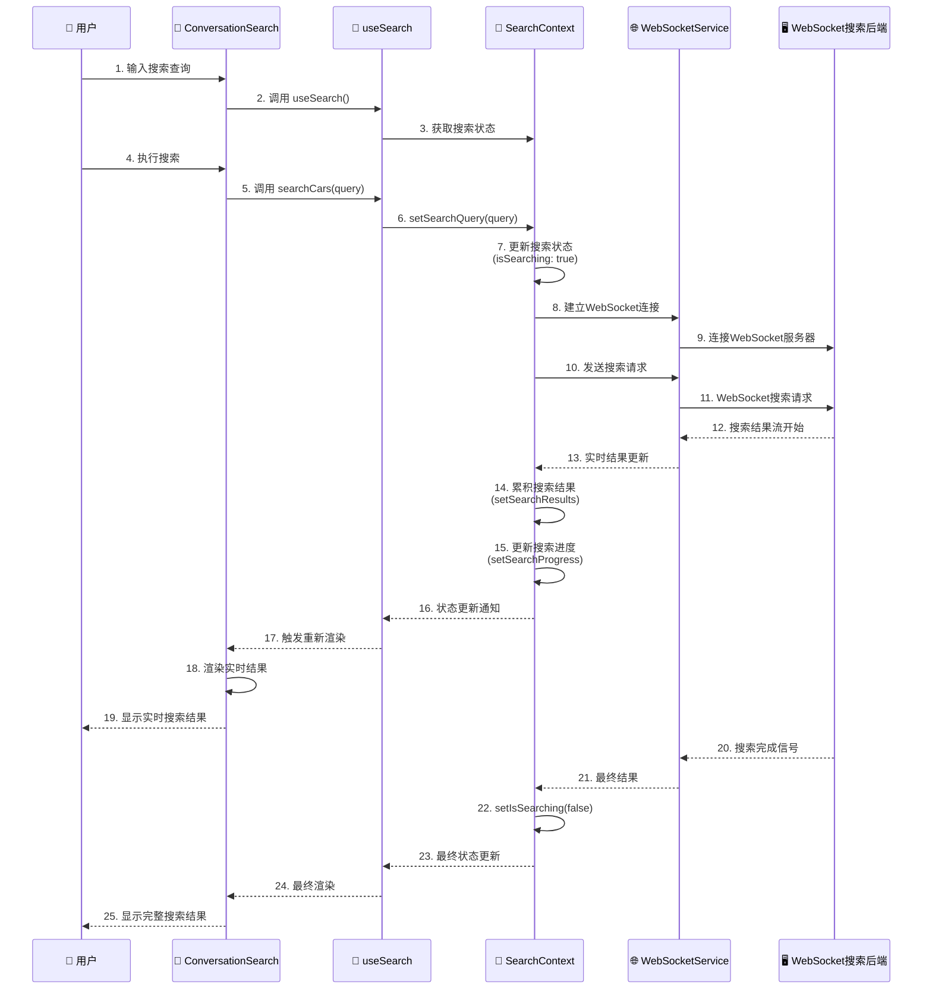
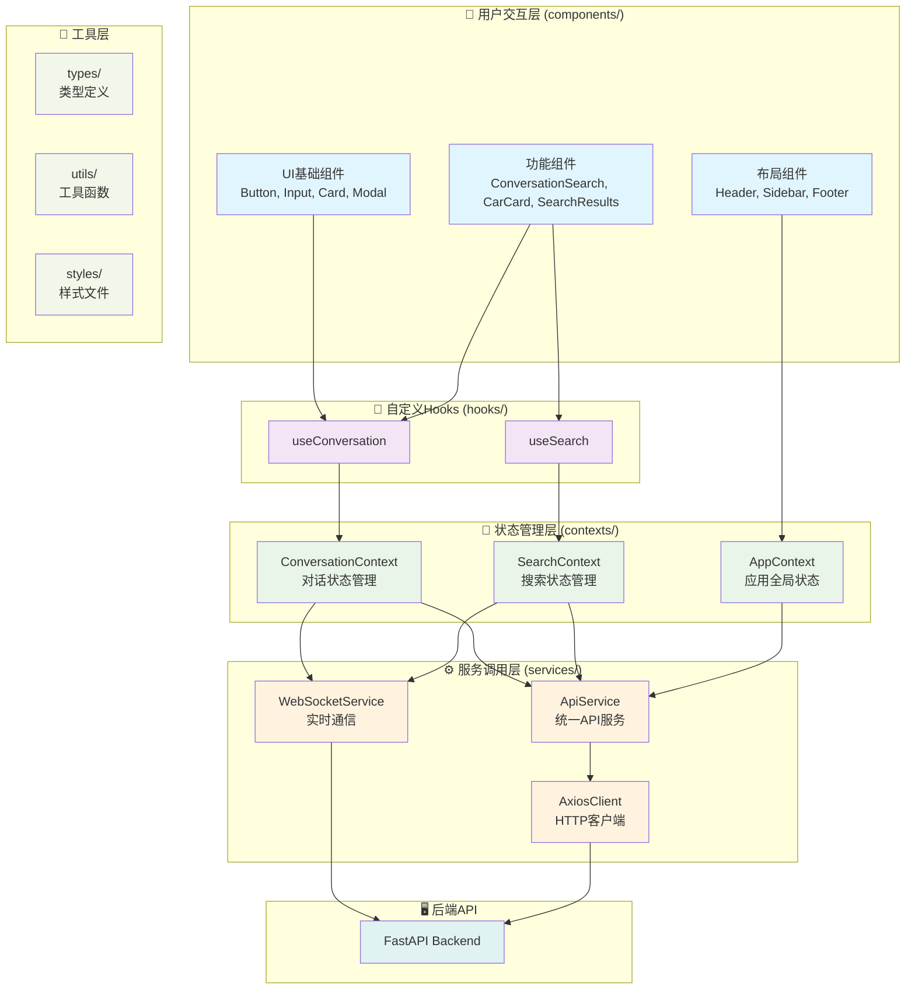
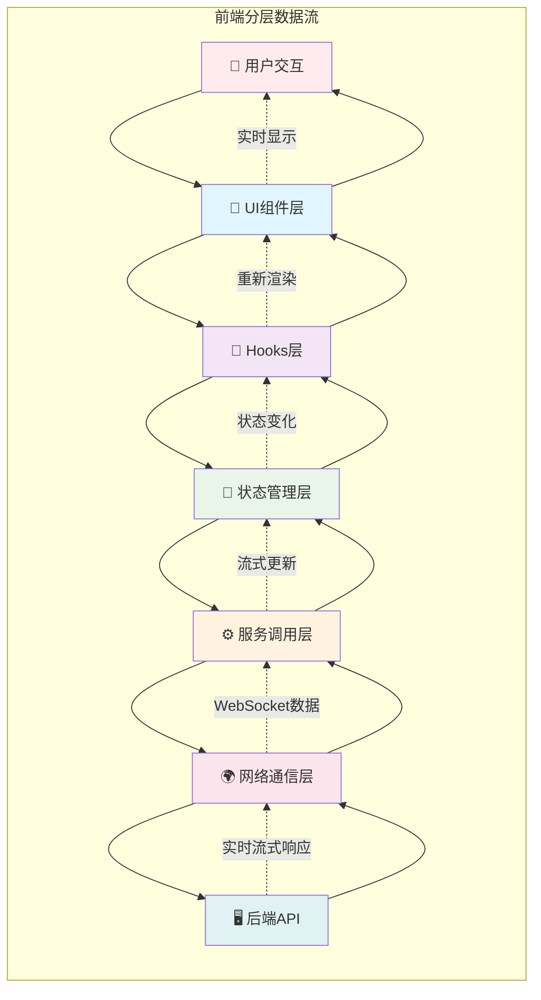

# 前端分层架构完整文档

## 📋 目录

1. [前端分层目录结构](#前端分层目录结构)
2. [WebSocket 实时数据流架构](#websocket实时数据流架构)
3. [UML 时序调用图](#uml-时序调用图)
4. [可视化架构图表](#可视化架构图表)
5. [分层架构优势](#分层架构优势)
6. [调用链总结](#调用链总结)

## 前端分层目录结构

```
frontend/src/
├── components/                    # 🎨 用户交互层
│   ├── ui/                       # 基础UI组件
│   │   ├── Button.tsx            # 按钮组件
│   │   ├── Input.tsx             # 输入框组件
│   │   ├── Card.tsx              # 卡片组件
│   │   └── Modal.tsx             # 模态框组件
│   ├── features/                 # 功能组件
│   │   ├── ConversationSearch.tsx    # 对话搜索主组件
│   │   ├── CarCard.tsx               # 车源卡片组件
│   │   ├── SearchResults.tsx         # 搜索结果组件
│   │   ├── SearchResults.css         # 搜索结果样式
│   │   ├── ProgressIndicator.tsx     # 进度指示器组件
│   │   ├── ProgressIndicator.css     # 进度指示器样式
│   │   ├── RealtimeMessageDisplay.tsx    # 实时消息显示组件
│   │   ├── RealtimeMessageDisplay.css    # 实时消息显示样式
│   │   └── index.ts              # 功能组件统一导出
│   ├── layout/                   # 布局组件
│   │   ├── Header.tsx            # 头部组件
│   │   ├── Header.css            # 头部样式
│   │   ├── Sidebar.tsx           # 侧边栏组件
│   │   ├── Sidebar.css            # 侧边栏样式
│   │   ├── Footer.tsx            # 底部组件
│   │   ├── Footer.css            # 底部样式
│   │   └── index.ts              # 布局组件统一导出
│   └── index.ts                  # 所有组件统一导出
├── contexts/                     # 🔄 状态管理层
│   ├── index.ts                  # 所有Context统一导出
│   ├── conversation/             # 对话相关状态
│   │   ├── ConversationContext.tsx    # 对话上下文定义
│   │   └── ConversationProvider.tsx   # 对话状态提供者
│   ├── search/                   # 搜索相关状态
│   │   ├── SearchContext.tsx     # 搜索上下文定义
│   │   └── SearchProvider.tsx    # 搜索状态提供者
│   └── app/                      # 应用全局状态
│       ├── AppContext.tsx        # 应用上下文定义
│       └── AppProvider.tsx       # 应用状态提供者
├── services/                     # ⚙️ 服务调用层 + 🌍 网络通信层
│   ├── index.ts                  # 所有服务统一导出
│   ├── README.md                 # 服务层说明文档
│   ├── api/                      # API调用服务
│   │   ├── api.ts                # 统一API服务类
│   │   └── index.ts              # API服务导出
│   ├── http/                     # HTTP请求服务
│   │   ├── axiosClient.ts        # Axios客户端封装
│   │   ├── requestInterceptor.ts # 请求拦截器
│   │   ├── responseInterceptor.ts# 响应拦截器
│   │   └── index.ts              # HTTP服务导出
│   ├── websocket/                # WebSocket实时通信服务
│   │   ├── websocketService.ts   # WebSocket服务类
│   │   ├── messageHandler.ts     # 消息处理器
│   │   ├── connectionManager.ts  # 连接管理器
│   │   └── index.ts              # WebSocket服务导出
│   └── utils/                    # 服务工具
│       ├── apiUtils.ts           # API工具函数
│       ├── errorHandler.ts       # 错误处理器
│       └── index.ts              # 服务工具导出
├── hooks/                        # 🔗 自定义Hooks
│   ├── index.ts                  # 所有Hooks统一导出
│   ├── useConversation.ts        # 对话相关Hook
│   └── useSearch.ts              # 搜索相关Hook
├── types/                        # 📝 类型定义
│   ├── index.ts                  # 所有类型统一导出
│   ├── api.ts                    # API相关类型
│   ├── conversation.ts           # 对话相关类型
│   ├── search.ts                 # 搜索相关类型
│   ├── car.ts                    # 车源相关类型
│   └── websocket.ts              # WebSocket相关类型
├── utils/                        # 🛠️ 工具函数
│   ├── index.ts                  # 所有工具统一导出
│   ├── logger.ts                 # 日志工具
│   ├── validation.ts             # 验证工具
│   ├── formatters.ts             # 格式化工具
│   └── constants.ts              # 常量定义
├── styles/                       # 🎨 样式文件
│   ├── globals.css               # 全局样式
│   ├── components.css            # 组件样式
│   └── themes/                   # 主题样式
│       ├── light.css             # 浅色主题
│       └── dark.css              # 深色主题
├── examples/                     # 📚 示例代码
├── App.tsx                       # 主应用组件
├── main.tsx                     # 应用入口
└── vite-env.d.ts                # Vite类型定义
```

## 🎨 组件层架构详细说明

### 📁 UI 基础组件 (components/ui/)

#### 🔘 Button 组件

- **功能**: 通用按钮组件，支持多种样式和尺寸
- **主要属性**:
  - `variant`: 按钮样式 (primary/secondary/danger)
  - `size`: 按钮尺寸 (sm/md/lg)
  - `disabled`: 禁用状态
  - `onClick`: 点击事件处理
- **特点**: 统一的样式系统，支持 Tailwind CSS

#### 📝 Input 组件

- **功能**: 通用输入框组件
- **主要属性**:
  - `type`: 输入类型 (text/email/password 等)
  - `placeholder`: 占位符文本
  - `value`: 输入值
  - `onChange`: 值变化处理
- **特点**: 支持表单验证和错误状态显示

#### 🃏 Card 组件

- **功能**: 通用卡片容器组件
- **主要属性**:
  - `title`: 卡片标题
  - `children`: 卡片内容
  - `className`: 自定义样式
- **特点**: 统一的卡片样式，支持阴影和圆角

#### 🪟 Modal 组件

- **功能**: 模态框组件
- **主要属性**:
  - `isOpen`: 显示状态
  - `onClose`: 关闭处理
  - `title`: 模态框标题
  - `children`: 模态框内容
- **特点**: 支持 ESC 键关闭，点击遮罩关闭

### 🚀 功能组件 (components/features/)

#### 💬 ConversationSearch 组件

- **功能**: 对话搜索主组件，集成对话和搜索功能
- **主要特性**:
  - 实时消息显示和发送
  - 快速问题示例
  - 自动滚动到底部
  - 实时消息状态显示
  - 错误处理和重试机制
- **状态管理**: 使用`useConversation` Hook
- **样式**: 集成`components.css`样式文件

#### 🚗 CarCard 组件

- **功能**: 车源信息卡片组件
- **主要属性**:
  - `car`: 车源数据对象
  - 显示车源标题、价格、年份、里程等信息
  - 点击跳转到车源详情页面
- **特点**: 响应式设计，支持悬停效果

#### 🔍 SearchResults 组件

- **功能**: 搜索结果展示组件
- **主要属性**:
  - `results`: 搜索结果数组
  - `isLoading`: 加载状态
  - `onCarSelect`: 车源选择回调
- **特点**: 网格布局，支持加载状态显示

#### 📊 ProgressIndicator 组件

- **功能**: 进度指示器组件
- **主要属性**:
  - `progress`: 进度百分比
  - `message`: 进度消息
  - `isVisible`: 显示状态
- **特点**: 动画效果，支持自定义消息

#### 📡 RealtimeMessageDisplay 组件

- **功能**: 实时消息显示组件
- **主要特性**:
  - 显示后端实时业务消息
  - 支持多种消息类型
  - 自动滚动和消息管理
- **样式**: 独立的 CSS 文件管理样式

### 🏗️ 布局组件 (components/layout/)

#### 📋 Header 组件

- **功能**: 应用头部导航组件
- **主要特性**:
  - 品牌标识显示
  - 导航菜单
  - 用户状态显示
- **样式**: 独立的 CSS 文件

#### 📑 Sidebar 组件

- **功能**: 侧边栏导航组件
- **主要特性**:
  - 导航菜单
  - 折叠/展开功能
  - 响应式设计
- **样式**: 独立的 CSS 文件

#### 🔚 Footer 组件

- **功能**: 应用底部组件
- **主要特性**:
  - 版权信息
  - 链接导航
  - 联系信息
- **样式**: 独立的 CSS 文件

## 🔄 状态管理层架构详细说明

### 💬 对话状态管理 (contexts/conversation/)

#### ConversationContext

- **功能**: 对话状态上下文定义
- **主要状态**:
  - `messages`: 对话消息列表
  - `isLoading`: 加载状态
  - `error`: 错误信息
  - `realtimeMessages`: 实时消息列表
- **主要方法**:
  - `sendMessage`: 发送消息
  - `clearMessages`: 清空消息
  - `addRealtimeMessage`: 添加实时消息

#### ConversationProvider

- **功能**: 对话状态提供者组件
- **主要特性**:
  - 管理对话状态
  - 处理 WebSocket 连接
  - 错误处理和重试
- **集成服务**: WebSocket 服务和 API 服务

### 🔍 搜索状态管理 (contexts/search/)

#### SearchContext

- **功能**: 搜索状态上下文定义
- **主要状态**:
  - `searchResults`: 搜索结果
  - `isSearching`: 搜索状态
  - `searchQuery`: 搜索查询
  - `error`: 错误信息
- **主要方法**:
  - `searchCars`: 执行搜索
  - `clearResults`: 清空结果
  - `setSearchQuery`: 设置查询

#### SearchProvider

- **功能**: 搜索状态提供者组件
- **主要特性**:
  - 管理搜索状态
  - 处理搜索请求
  - 结果缓存和管理
- **集成服务**: API 服务和 WebSocket 服务

### 🏠 应用状态管理 (contexts/app/)

#### AppContext

- **功能**: 应用全局状态上下文定义
- **主要状态**:
  - `theme`: 主题设置
  - `user`: 用户信息
  - `settings`: 应用设置
- **主要方法**:
  - `setTheme`: 设置主题
  - `updateUser`: 更新用户信息
  - `updateSettings`: 更新设置

#### AppProvider

- **功能**: 应用状态提供者组件
- **主要特性**:
  - 管理全局状态
  - 主题切换
  - 用户认证状态
- **集成服务**: 本地存储和 API 服务

## 🔗 自定义 Hooks 架构详细说明

### 💬 useConversation Hook

- **功能**: 对话相关逻辑封装
- **主要返回值**:
  - `messages`: 对话消息
  - `isLoading`: 加载状态
  - `error`: 错误信息
  - `sendMessage`: 发送消息函数
  - `realtimeMessages`: 实时消息
- **主要特性**:
  - 自动 WebSocket 连接管理
  - 消息状态同步
  - 错误处理和重试

### 🔍 useSearch Hook

- **功能**: 搜索相关逻辑封装
- **主要返回值**:
  - `searchResults`: 搜索结果
  - `isSearching`: 搜索状态
  - `searchQuery`: 搜索查询
  - `searchCars`: 搜索函数
- **主要特性**:
  - 搜索状态管理
  - 结果缓存
  - 实时搜索更新

## HTTP 服务层架构

### 🌐 HTTP 服务层设计概述

HTTP 服务层为前端提供了统一的 HTTP 通信能力，支持 RESTful API 调用、请求/响应拦截、错误处理和重试机制。与 WebSocket 实时通信形成互补，为不同类型的业务场景提供合适的通信方式。

### 📁 HTTP 服务层详细结构

```
frontend/src/services/http/
├── axiosClient.ts         # 基于axios的HTTP客户端封装
├── requestInterceptor.ts  # 请求拦截器
├── responseInterceptor.ts # 响应拦截器
└── index.ts              # 统一导出
```

## ⚙️ 服务层架构详细说明

### 🌐 HTTP 服务层 (services/http/)

#### AxiosClient 核心服务

- **功能**: 基于 axios 的 HTTP 客户端封装
- **主要特性**:
  - 统一的请求/响应处理
  - 自动拦截器配置
  - 错误处理和重试机制
  - TypeScript 类型支持
- **主要方法**:
  - `get<T>()`: GET 请求
  - `post<T>()`: POST 请求
  - `put<T>()`: PUT 请求
  - `delete<T>()`: DELETE 请求

#### RequestInterceptor 请求拦截器

- **功能**: 请求前处理
- **主要特性**:
  - 自动添加认证 token
  - 请求 ID 生成和追踪
  - 请求时间戳记录
  - 统一请求头设置

#### ResponseInterceptor 响应拦截器

- **功能**: 响应后处理
- **主要特性**:
  - 响应时间计算
  - 统一错误处理
  - 状态码分类处理
  - 网络错误处理

### 🔌 API 服务层 (services/api/)

#### ApiService 统一 API 服务

- **功能**: 统一的后端 API 调用服务
- **主要方法**:
  - `searchCars()`: 车源搜索
  - `sendConversationMessage()`: 发送对话消息
  - `getCarDetails()`: 获取车源详情
  - `login()`: 用户登录
  - `register()`: 用户注册
- **主要特性**:
  - 统一的错误处理
  - 请求日志记录
  - 类型安全的数据传输

### 📡 WebSocket 服务层 (services/websocket/)

#### WebSocketService 核心服务

- **功能**: WebSocket 连接管理
- **主要特性**:
  - 自动连接和重连
  - 心跳检测机制
  - 连接状态管理
  - 消息队列处理
- **主要方法**:
  - `connect()`: 建立连接
  - `disconnect()`: 断开连接
  - `sendMessage()`: 发送消息
  - `onMessage()`: 接收消息

#### MessageHandler 消息处理器

- **功能**: WebSocket 消息处理
- **主要特性**:
  - 消息类型识别
  - 消息路由分发
  - 消息队列管理
  - 消息格式转换

#### ConnectionManager 连接管理器

- **功能**: WebSocket 连接管理
- **主要特性**:
  - 连接池管理
  - 自动重连机制
  - 连接状态监控
  - 心跳保活

### 🛠️ 服务工具层 (services/utils/)

#### ApiUtils API 工具

- **功能**: API 相关工具函数
- **主要功能**:
  - URL 构建和参数处理
  - 请求数据格式化
  - 响应数据解析
  - 错误信息提取

#### ErrorHandler 错误处理器

- **功能**: 统一错误处理
- **主要特性**:
  - 错误分类处理
  - 用户友好错误信息
  - 错误日志记录
  - 错误恢复机制

## 📝 类型定义层架构详细说明

### 🔌 API 类型定义 (types/api.ts)

#### ApiResponse 基础响应类型

- **功能**: 统一的 API 响应格式
- **主要字段**:
  - `success`: 请求是否成功
  - `data`: 响应数据
  - `message`: 响应消息
  - `code`: 响应代码
  - `timestamp`: 时间戳

#### ApiError 错误响应类型

- **功能**: 统一的错误响应格式
- **主要字段**:
  - `success`: 固定为 false
  - `error`: 错误详情对象
  - `timestamp`: 错误时间戳

#### PaginatedResponse 分页响应类型

- **功能**: 分页数据响应格式
- **主要字段**:
  - `pagination`: 分页信息
  - `page`: 当前页码
  - `limit`: 每页数量
  - `total`: 总数量
  - `hasNext`: 是否有下一页

### 💬 对话类型定义 (types/conversation.ts)

#### Message 消息类型

- **功能**: 基础消息结构
- **主要字段**:
  - `id`: 消息唯一标识
  - `role`: 消息角色 (user/assistant/system)
  - `content`: 消息内容
  - `timestamp`: 时间戳
  - `metadata`: 元数据信息

#### ConversationMessage 对话消息类型

- **功能**: 用于 Context 的对话消息格式
- **主要字段**:
  - `role`: 消息角色
  - `content`: 消息内容
  - `timestamp`: 时间戳字符串

#### Conversation 对话类型

- **功能**: 完整对话结构
- **主要字段**:
  - `id`: 对话唯一标识
  - `title`: 对话标题
  - `messages`: 消息列表
  - `createdAt`: 创建时间
  - `updatedAt`: 更新时间

### 🚗 车源类型定义 (types/car.ts)

#### CarBrand 汽车品牌类型

- **功能**: 汽车品牌信息
- **主要字段**:
  - `id`: 品牌唯一标识
  - `name`: 品牌名称
  - `logo`: 品牌标志
  - `country`: 品牌国家
  - `foundedYear`: 成立年份

#### CarModel 汽车型号类型

- **功能**: 汽车型号信息
- **主要字段**:
  - `id`: 型号唯一标识
  - `brandId`: 品牌 ID
  - `name`: 型号名称
  - `year`: 年份
  - `bodyType`: 车身类型
  - `fuelType`: 燃料类型
  - `transmission`: 变速箱类型

#### CarListing 车源信息类型

- **功能**: 车源列表项信息
- **主要字段**:
  - `id`: 车源唯一标识
  - `title`: 车源标题
  - `price`: 价格
  - `year`: 年份
  - `mileage`: 里程
  - `location`: 位置
  - `link`: 详情链接
  - `imageUrl`: 图片 URL

### 📡 WebSocket 类型定义 (types/websocket.ts)

#### WebSocketMessage 消息类型

- **功能**: WebSocket 消息基础结构
- **主要字段**:
  - `type`: 消息类型
  - `data`: 消息数据
  - `timestamp`: 时间戳
  - `id`: 消息唯一标识

#### StreamResponse 流式响应类型

- **功能**: 流式响应数据结构
- **主要字段**:
  - `type`: 响应类型 (content/metadata/done/error)
  - `data`: 响应数据
  - `conversationId`: 对话 ID
  - `messageId`: 消息 ID
  - `chunkIndex`: 数据块索引

## 🛠️ 工具函数层架构详细说明

### 📝 Logger 日志工具 (utils/logger.ts)

#### EnhancedLogger 增强日志器

- **功能**: 基于 loglevel 的增强日志系统
- **主要特性**:
  - 统一的日志格式: `时间戳 | 执行序号 | 包名.方法名:行号 | 结论 - 原因`
  - 多级别日志支持 (debug/info/warn/error)
  - 开发/生产环境自动切换
  - 重复消息去重
  - 调用栈追踪
- **主要方法**:
  - `logResult()`: 记录结果日志
  - `logError()`: 记录错误日志
  - `logInfo()`: 记录信息日志
  - `logDebug()`: 记录调试日志

### ✅ Validation 验证工具 (utils/validation.ts)

#### 数据验证函数

- **功能**: 数据验证和清理
- **主要函数**:
  - `validateEmail()`: 邮箱验证
  - `validatePhone()`: 电话验证
  - `validateUrl()`: URL 验证
  - `sanitizeInput()`: 输入清理
  - `validateSearchQuery()`: 搜索查询验证

### 🎨 Formatters 格式化工具 (utils/formatters.ts)

#### 数据格式化函数

- **功能**: 数据格式化和显示
- **主要函数**:
  - `formatPrice()`: 价格格式化
  - `formatMileage()`: 里程格式化
  - `formatDate()`: 日期格式化
  - `formatNumber()`: 数字格式化
  - `truncateText()`: 文本截断

### 📊 Constants 常量定义 (utils/constants.ts)

#### 应用常量

- **功能**: 应用级常量定义
- **主要常量**:
  - `API_ENDPOINTS`: API 端点配置
  - `WEBSOCKET_CONFIG`: WebSocket 配置
  - `UI_CONSTANTS`: UI 相关常量
  - `ERROR_MESSAGES`: 错误消息
  - `VALIDATION_RULES`: 验证规则

## 🎨 样式系统架构详细说明

### 🌐 全局样式 (styles/globals.css)

- **功能**: 全局样式定义
- **主要内容**:
  - CSS 重置和基础样式
  - 全局字体和颜色变量
  - 通用工具类
  - 响应式断点定义

### 🎨 组件样式 (styles/components.css)

- **功能**: 组件专用样式
- **主要内容**:
  - 组件特定样式定义
  - 动画和过渡效果
  - 交互状态样式
  - 布局相关样式

### 🌓 主题系统 (styles/themes/)

- **功能**: 主题样式管理
- **主要特性**:
  - 浅色主题 (light.css)
  - 深色主题 (dark.css)
  - 主题切换支持
  - CSS 变量系统

## 🚀 服务层优势总结

### 1. 统一管理

- **统一配置**: 所有服务使用相同的配置和接口
- **统一拦截**: HTTP 请求和 WebSocket 消息统一处理
- **统一错误处理**: 集中处理各种错误情况

### 2. 功能丰富

- **自动重试**: 支持请求失败自动重试
- **请求追踪**: 每个请求都有唯一 ID 和时间戳
- **认证管理**: 自动添加认证 token
- **错误恢复**: 智能的错误处理和恢复机制

### 3. 开发友好

- **TypeScript 支持**: 完整的类型定义
- **Promise 支持**: 支持 async/await 语法
- **拦截器**: 灵活的请求/响应拦截
- **调试友好**: 详细的日志和错误信息

## 📡 WebSocket 实时数据流架构

### 🚀 实时数据流设计概述

WebSocket 实时数据流架构为前端提供了真正的实时通信能力，支持流式对话响应、实时搜索更新和动态数据推送。

### 📁 WebSocket 服务层详细结构

```
frontend/src/services/websocket/
├── websocketService.ts           # 核心WebSocket服务
│   ├── WebSocketService类        # 连接管理
│   ├── 连接状态管理               # 连接/断开/重连
│   ├── 消息发送/接收              # 双向通信
│   └── 错误处理机制               # 异常恢复
├── messageHandler.ts             # 消息处理器
│   ├── MessageHandler类          # 消息路由
│   ├── 消息类型识别               # 内容/元数据/错误
│   ├── 消息队列管理               # 缓存和重发
│   └── 消息转换器                # 格式标准化
├── connectionManager.ts          # 连接管理器
│   ├── ConnectionManager类       # 连接池管理
│   ├── 自动重连机制               # 断线重连
│   ├── 心跳检测                   # 连接保活
│   └── 连接状态监控               # 状态追踪
└── index.ts                      # 统一导出
    ├── WebSocketService          # 主服务
    ├── MessageHandler            # 消息处理
    ├── ConnectionManager         # 连接管理
    └── 类型定义                  # TypeScript类型
```

### 🔄 实时数据流核心特性

#### WebSocketService 核心服务

- **功能**: WebSocket 连接管理
- **主要特性**:
  - 自动连接和重连机制
  - 心跳检测保活
  - 连接状态监控
  - 消息队列处理
- **配置选项**:
  - `url`: WebSocket 服务器地址
  - `reconnectInterval`: 重连间隔
  - `maxReconnectAttempts`: 最大重连次数
  - `heartbeatInterval`: 心跳间隔

#### MessageHandler 消息处理器

- **功能**: WebSocket 消息处理
- **主要特性**:
  - 消息类型识别和路由
  - 消息队列管理
  - 消息格式转换
  - 错误消息处理

#### ConnectionManager 连接管理器

- **功能**: WebSocket 连接管理
- **主要特性**:
  - 连接池管理
  - 自动重连机制
  - 连接状态监控
  - 心跳保活机制

### 🎯 实时数据流优势

#### 1. 用户体验提升

- **即时响应**: 用户输入后立即开始接收回复
- **流式显示**: AI 回复逐字显示，提升交互感
- **实时搜索**: 搜索结果实时更新，无需等待

#### 2. 性能优化

- **减少等待时间**: 不需要等待完整响应
- **降低服务器压力**: 流式传输减少内存占用
- **提高并发能力**: WebSocket 支持更高并发

#### 3. 技术优势

- **双向通信**: 支持实时双向数据交换
- **连接复用**: 单连接支持多种数据流
- **自动重连**: 网络异常时自动恢复连接

## UML 时序调用图

### 1. 用户发送消息的完整调用流程（WebSocket 实时流式）



### 2. 车源搜索的完整调用流程（WebSocket 实时搜索）



## 可视化架构图表

### 前端分层架构图



### 数据流向图（支持实时流式）



## 分层架构优势

### 1. 职责分离

- **UI 组件层**: 专注于用户界面展示和交互
- **Hooks 层**: 封装可复用的状态逻辑
- **状态管理层**: 统一管理应用状态
- **服务调用层**: 统一的 API 调用服务和 WebSocket 实时通信
- **网络通信层**: 基于 axios 的 HTTP 通信和 WebSocket 实时通信

### 2. 可维护性

- 每层职责明确，易于理解和修改
- 代码结构清晰，便于团队协作
- 支持独立测试和调试

### 3. 可扩展性

- 新功能可以独立开发和集成
- 支持渐进式重构
- 便于添加新的数据源或服务
- WebSocket 服务支持多种实时数据流类型

### 4. 可复用性

- 组件和服务可在不同场景下复用
- Hooks 可以跨组件共享逻辑
- 统一的 API 服务支持多种调用模式
- WebSocket 服务支持多种实时通信场景

### 5. 类型安全

- TypeScript 提供完整的类型检查
- 接口定义清晰，减少运行时错误
- IDE 支持智能提示和重构
- WebSocket 消息类型定义确保实时通信安全

### 6. 实时通信优势

- **即时响应**: 用户输入后立即开始接收回复
- **流式显示**: AI 回复逐字显示，提升交互感
- **实时搜索**: 搜索结果实时更新，无需等待
- **双向通信**: 支持实时双向数据交换
- **连接复用**: 单连接支持多种数据流
- **自动重连**: 网络异常时自动恢复连接

## 调用链总结

### HTTP 调用链

```
用户交互 → UI组件 → Hooks → Context → API服务 → AxiosClient → RequestInterceptor → 后端
    ↑                                                                                    ↓
    ← 状态更新 ← 组件渲染 ← Context ← ResponseInterceptor ← 响应数据 ← 网络层 ←
```

### WebSocket 实时调用链

```
用户交互 → UI组件 → Hooks → Context → WebSocket服务 → WebSocket → 后端
    ↑                                                      ↓
    ← 实时更新 ← 流式渲染 ← Context ← 流式数据 ← 实时通信 ←
```

这种分层架构确保了：

- **单向数据流**: 数据从 API 服务层流向 UI 层
- **实时数据流**: WebSocket 支持流式数据实时更新
- **状态集中管理**: 通过 Context 统一管理状态
- **关注点分离**: 每层专注于特定职责
- **简化架构**: 减少不必要的复杂性，提高开发效率
- **实时体验**: 支持流式对话和实时搜索

## 总结

前端分层架构通过以下方式实现：

1. **清晰的职责分离**: 每层专注于特定功能
2. **单向数据流**: 确保数据流向的可预测性
3. **实时数据流**: WebSocket 支持流式数据实时更新
4. **组件化设计**: 提高代码复用性和可维护性
5. **类型安全**: TypeScript 提供完整的类型检查
6. **简化架构**: 统一的 API 服务和 WebSocket 实时通信
7. **状态管理**: 集中化的状态管理
8. **网络通信**: 基于 AxiosClient 的 HTTP 通信和 WebSocket 实时通信
9. **实时体验**: 支持流式对话和实时搜索功能
10. **业务消息显示**: 实时显示后端业务逻辑状态和进度

### 🌐 HTTP 服务层架构特点

- **统一管理**: 所有 HTTP 请求使用相同的配置和拦截器
- **自动认证**: 自动添加认证 token 和请求追踪
- **错误处理**: 智能的错误处理和状态码管理
- **请求拦截**: 统一的请求前处理和响应后处理
- **类型安全**: 完整的 TypeScript 类型定义
- **调试友好**: 详细的请求日志和性能监控

### 🚀 WebSocket 实时数据流架构特点

- **流式对话**: AI 回复逐字显示，提升用户体验
- **实时搜索**: 搜索结果实时更新，无需等待完整响应
- **双向通信**: 支持实时双向数据交换
- **连接管理**: 自动重连和心跳检测机制
- **消息处理**: 统一的消息路由和处理机制
- **错误恢复**: 网络异常时的自动恢复能力

这种架构确保了代码的可维护性、可扩展性和可测试性，同时提供了真正的实时通信能力，为团队提供了清晰的开发指导和技术规范，支持现代化的实时应用开发需求。
