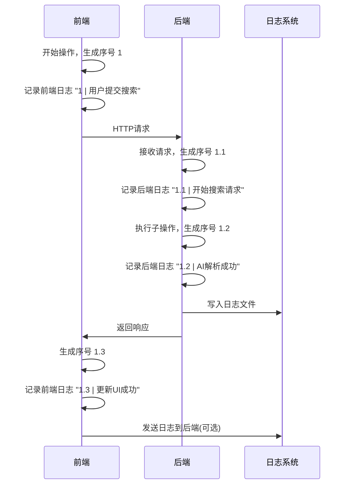

# 📋 日志设计文档 - 前后端统一日志规范

## 📖 文档概述

本文档定义了瑞辉汽车顾问系统的统一日志规范，确保前后端日志能够有效链接，便于问题追踪和系统监控。

### 🎯 设计目标

1. **前后端链接**: 通过统一的追踪ID实现前后端日志关联
2. **见名知意**: 日志内容简洁明了，快速理解业务操作
3. **结构化**: 统一的日志格式，便于解析和分析
4. **可追踪**: 完整的调用链路追踪
5. **性能友好**: 最小化日志对系统性能的影响

## 🏗️ 日志架构设计

### 核心组件

```
┌─────────────────┐    ┌─────────────────┐    ┌─────────────────┐
│   前端日志器     │    │   后端日志器     │    │   日志聚合器     │
│  (TypeScript)   │◄──►│   (Python)      │◄──►│   (File/DB)     │
└─────────────────┘    └─────────────────┘    └─────────────────┘
         │                       │                       │
         ▼                       ▼                       ▼
┌─────────────────┐    ┌─────────────────┐    ┌─────────────────┐
│   请求追踪ID     │    │   请求追踪ID     │    │   统一存储      │
│   (Trace ID)    │    │   (Trace ID)    │    │   (Storage)     │
└─────────────────┘    └─────────────────┘    └─────────────────┘
```

## 📝 日志格式规范

### 统一日志格式

```
时间戳 | 执行序号 | 包名.方法名:行号 | 结论 - 原因
```

### 格式说明

| 字段 | 说明 | 示例 | 长度限制 |
|------|------|------|----------|
| 时间戳 | ISO 8601格式 | 2025-01-06 14:30:25 | - |
| 执行序号 | 执行顺序标识 | 1, 1.1, 1.1.1 | 10字符 |
| 包名.方法名:行号 | 调用位置 | app.api.routes.search_cars:25 | 50字符 |
| 结论 - 原因 | 操作结果和原因 | 开始搜索请求 - 用户输入"2020年丰田凯美瑞" | 200字符 |

### 关键部位日志策略

**只在以下关键部位加日志**：
1. **入口点** - API接口、主要业务函数
2. **关键决策点** - 条件分支、异常处理
3. **外部调用** - 数据库、第三方API、爬虫
4. **状态变化** - 数据转换、状态更新
5. **错误处理** - 异常捕获、错误恢复

### 示例日志

#### 后端日志
```
2025-01-06 14:30:25 | 1 | app.api.routes.search_cars:25 | 开始搜索请求 - 用户输入"2020年丰田凯美瑞"
2025-01-06 14:30:26 | 1.1 | app.services.gemini_service.parse_query:15 | AI解析成功 - 品牌=Toyota, 车型=Camry, 年份=2020
2025-01-06 14:30:28 | 1.2 | app.services.cargurus_scraper.search:45 | 爬虫搜索完成 - 找到15辆车源，耗时2.3秒
2025-01-06 14:30:29 | 1.3 | app.services.gemini_service.analyze:78 | AI分析完成 - 推荐3辆性价比最高的车
2025-01-06 14:30:30 | 1.4 | app.api.routes.search_cars:25 | 搜索成功 - 返回15条结果给前端
```

#### 前端日志
```
2025-01-06 14:30:25 | 1 | src.components.SearchForm.handleSubmit:45 | 用户提交搜索 - 查询"2020年丰田凯美瑞"
2025-01-06 14:30:25 | 1.1 | src.components.SearchForm.handleSubmit:50 | 发送API请求 - POST /api/search，参数已序列化
2025-01-06 14:30:28 | 1.2 | src.components.SearchForm.handleResponse:78 | 接收搜索结果 - 15条数据，状态码200
2025-01-06 14:30:28 | 1.3 | src.components.SearchForm.handleResponse:85 | 更新UI成功 - 显示15辆车源卡片
2025-01-06 14:30:29 | 1.4 | src.components.CarList.render:92 | 渲染完成 - 15个CarCard组件已挂载
```

## 🔗 前后端链接机制

### 执行序号系统

#### 1. 序号生成规则
- **格式**: `数字.数字.数字` (如: 1, 1.1, 1.1.1)
- **生成时机**: 每次关键操作时自动递增
- **作用范围**: 单次用户操作完整流程
- **嵌套支持**: 支持主操作和子操作的层级关系

#### 2. 序号管理策略
- **主操作**: 使用整数序号 (1, 2, 3...)
- **子操作**: 使用小数序号 (1.1, 1.2, 1.3...)
- **嵌套操作**: 使用多级小数 (1.1.1, 1.1.2...)
- **线程安全**: 使用锁机制保证序号唯一性

### 前后端日志关联流程



## 📊 关键部位日志规范

### 日志添加原则

**只在以下关键部位加日志**：
1. **入口点** - API接口、主要业务函数
2. **关键决策点** - 条件分支、异常处理
3. **外部调用** - 数据库、第三方API、爬虫
4. **状态变化** - 数据转换、状态更新
5. **错误处理** - 异常捕获、错误恢复

### 关键部位分布

#### 后端关键点
```python
# 1. API入口点
@router.post("/search")
async def search_cars(request: SearchRequest):
    logger.log_result("开始搜索请求", f"用户输入: {request.query}")

# 2. 外部调用点
async def search_cars_on_cargurus(query):
    logger.log_result("开始爬虫搜索", f"查询: {query}")
    # ... 爬虫逻辑 ...
    logger.log_result("爬虫搜索完成", f"找到{len(cars)}辆车源")

# 3. AI服务调用点
async def parse_query_with_ai(query):
    logger.log_result("开始AI解析", f"原始查询: {query}")
    # ... AI解析逻辑 ...
    logger.log_result("AI解析成功", f"品牌={result.brand}, 车型={result.model}")

# 4. 错误处理点
try:
    # ... 业务逻辑 ...
except Exception as e:
    logger.log_result("操作失败", f"错误: {str(e)}")
```

#### 前端关键点
```typescript
// 1. 用户交互入口点
const handleSubmit = async (formData: SearchFormData) => {
  logger.logResult("用户提交搜索", `查询: ${formData.query}`);
};

// 2. API调用点
const searchCars = async (query: string) => {
  logger.logResult("发送API请求", `POST /api/search`);
  // ... API调用 ...
  logger.logResult("API请求成功", `返回${data.length}条结果`);
};

// 3. 状态变化点
const updateSearchResults = (results: Car[]) => {
  logger.logResult("更新搜索结果", `显示${results.length}辆车源`);
  setSearchResults(results);
};

// 4. 错误处理点
catch (error) {
  logger.logResult("操作失败", `错误: ${error.message}`);
}
```

## 🛠️ 实现规范

### 后端实现 (Python)

#### 1. 关键部位日志器
```python
# backend/utils/logger.py
import logging
import os
import inspect
from datetime import datetime
import threading

class KeyPointLogger:
    def __init__(self):
        self.sequence_counter = 0
        self.lock = threading.Lock()
        self.logger = self._setup_logger()
    
    def _setup_logger(self):
        os.makedirs('logs', exist_ok=True)
        
        logger = logging.getLogger('key_points')
        logger.setLevel(logging.INFO)
        
        # 文件处理器
        file_handler = logging.FileHandler('logs/app.log', encoding='utf-8')
        formatter = logging.Formatter('%(asctime)s | %(sequence)s | %(call_stack)s | %(message)s')
        file_handler.setFormatter(formatter)
        logger.addHandler(file_handler)
        
        # 控制台处理器
        console_handler = logging.StreamHandler()
        console_handler.setFormatter(formatter)
        logger.addHandler(console_handler)
        
        return logger
    
    def _get_next_sequence(self):
        with self.lock:
            self.sequence_counter += 1
            return str(self.sequence_counter)
    
    def _get_call_stack(self):
        frame = inspect.currentframe().f_back.f_back
        module_name = frame.f_globals.get('__name__', 'unknown')
        function_name = frame.f_code.co_name
        line_number = frame.f_lineno
        
        if module_name.startswith('app.'):
            package_path = module_name
        else:
            package_path = f"app.{module_name}"
        
        return f"{package_path}.{function_name}:{line_number}"
    
    def log_result(self, conclusion: str, reason: str = ""):
        """只在关键部位记录日志"""
        sequence = self._get_next_sequence()
        call_stack = self._get_call_stack()
        
        if reason:
            message = f"{conclusion} - {reason}"
        else:
            message = conclusion
        
        self.logger.info(message, extra={
            'sequence': sequence,
            'call_stack': call_stack
        })

# 全局实例
logger = KeyPointLogger()
```

#### 2. 使用示例
```python
# 关键部位日志使用
@router.post("/search")
async def search_cars(request: SearchRequest):
    logger.log_result("开始搜索请求", f"用户输入: {request.query}")
    
    try:
        # 外部调用：AI解析
        parsed_query = await gemini_service.parse_query(request.query)
        logger.log_result("AI解析成功", f"品牌={parsed_query.brand}, 车型={parsed_query.model}")
        
        # 外部调用：爬虫搜索
        cars = await cargurus_scraper.search(parsed_query)
        logger.log_result("爬虫搜索完成", f"找到{len(cars)}辆车源")
        
        logger.log_result("搜索成功", f"返回{len(cars)}条结果")
        return cars
        
    except Exception as e:
        logger.log_result("搜索失败", f"错误: {str(e)}")
        raise
```

### 前端实现 (TypeScript)

#### 1. 关键部位日志器
```typescript
// frontend/src/utils/logger.ts
class KeyPointLogger {
  private sequenceCounter: number = 0;
  
  private getCallStack(): string {
    const stack = new Error().stack;
    if (!stack) return 'unknown:0';
    
    const lines = stack.split('\n');
    const callerLine = lines[3] || lines[2];
    
    if (callerLine) {
      const match = callerLine.match(/at\s+(.+?)\s+\((.+?):(\d+):\d+\)/);
      if (match) {
        const [, functionName, filePath, lineNumber] = match;
        const packagePath = filePath
          .replace(/\\/g, '/')
          .replace(/.*\/src\//, 'src.')
          .replace(/\.tsx?$/, '')
          .replace(/\//g, '.');
        
        return `${packagePath}.${functionName}:${lineNumber}`;
      }
    }
    
    return 'unknown:0';
  }
  
  private async writeToFile(message: string, sequence: string) {
    const callStack = this.getCallStack();
    
    try {
      await fetch('/api/logs/frontend', {
        method: 'POST',
        headers: { 'Content-Type': 'application/json' },
        body: JSON.stringify({
          message,
          sequence,
          callStack,
          timestamp: new Date().toISOString()
        })
      });
    } catch (error) {
      console.error('Failed to write log to file:', error);
    }
  }
  
  async logResult(conclusion: string, reason: string = ''): Promise<void> {
    this.sequenceCounter++;
    const sequence = this.sequenceCounter.toString();
    const callStack = this.getCallStack();
    const message = reason ? `${conclusion} - ${reason}` : conclusion;
    
    // 控制台输出
    console.log(`${sequence} | ${callStack} | ${message}`);
    
    // 写入文件
    await this.writeToFile(message, sequence);
  }
}

// 全局实例
const logger = new KeyPointLogger();
```

#### 2. 使用示例
```typescript
// 关键部位日志使用
const handleSubmit = async (formData: SearchFormData) => {
  logger.logResult("用户提交搜索", `查询: ${formData.query}`);
  
  try {
    // 外部调用：API请求
    const response = await api.searchCars(formData);
    logger.logResult("API请求成功", `返回${response.data.length}条结果`);
    
    // 状态变化：更新UI
    setSearchResults(response.data);
    logger.logResult("UI更新成功", `显示${response.data.length}辆车源`);
    
  } catch (error) {
    logger.logResult("搜索失败", `错误: ${error.message}`);
    setError(error.message);
  }
};
```

## 📁 日志存储规范

### 文件命名规则
```
logs/
├── {module_name}_{YYYYMMDD}.log          # 模块日志
├── api_routes_{YYYYMMDD}.log             # API路由日志
├── search_service_{YYYYMMDD}.log         # 搜索服务日志
├── gemini_service_{YYYYMMDD}.log         # AI服务日志
├── cargurus_scraper_{YYYYMMDD}.log       # 爬虫服务日志
└── rehui_car_adviser_{YYYYMMDD}.log      # 主应用日志
```

### 日志轮转策略
- **按天轮转**: 每天创建新的日志文件
- **保留期限**: 保留最近30天的日志
- **压缩策略**: 超过7天的日志自动压缩
- **清理策略**: 超过30天的日志自动删除

## 🔍 日志查询和分析

### 常用查询模式

#### 1. 按执行序号追踪完整流程
```bash
# 查看完整的执行流程
grep "1\." backend/logs/app.log frontend/logs/app.log

# 查看特定操作的子步骤
grep "1.1" backend/logs/app.log frontend/logs/app.log

# 查看所有主操作
grep "^[0-9]* | [0-9]* |" backend/logs/app.log frontend/logs/app.log

# 查看所有子操作
grep " | [0-9]*\.[0-9]* |" backend/logs/app.log frontend/logs/app.log
```

#### 2. 按关键点查询
```bash
# 查看所有入口点
grep "开始" backend/logs/app.log frontend/logs/app.log

# 查看所有外部调用
grep "爬虫\|API\|AI" backend/logs/app.log frontend/logs/app.log

# 查看所有状态变化
grep "更新\|完成\|成功" backend/logs/app.log frontend/logs/app.log

# 查看所有错误
grep "失败\|错误" backend/logs/app.log frontend/logs/app.log
```

#### 3. 按模块查询
```bash
# 查看API层日志
grep "app.api" backend/logs/app.log

# 查看服务层日志
grep "app.services" backend/logs/app.log

# 查看组件日志
grep "src.components" frontend/logs/app.log
```

#### 4. 按操作类型查询
```bash
# 查看所有开始操作
grep "开始" backend/logs/app.log frontend/logs/app.log

# 查看所有完成操作
grep "完成" backend/logs/app.log frontend/logs/app.log

# 查看所有成功操作
grep "成功" backend/logs/app.log frontend/logs/app.log
```

### 日志分析工具

#### 1. 实时监控脚本
```bash
#!/bin/bash
# 实时监控错误日志
tail -f logs/*.log | grep -E "(失败|错误)"
```

#### 2. 日志统计脚本
```bash
#!/bin/bash
# 统计今日日志
echo "=== 今日日志统计 ==="
echo "总日志数: $(grep "$(date +%Y-%m-%d)" logs/*.log | wc -l)"
echo "错误日志数: $(grep "$(date +%Y-%m-%d)" logs/*.log | grep -E "(失败|错误)" | wc -l)"
echo "API请求数: $(grep "$(date +%Y-%m-%d)" logs/*.log | grep "API" | wc -l)"
echo "搜索成功数: $(grep "$(date +%Y-%m-%d)" logs/*.log | grep "成功" | wc -l)"
```

#### 3. 执行流程分析脚本
```bash
#!/bin/bash
# 分析执行流程
echo "=== 执行流程分析 ==="
echo "主操作数: $(grep "^[0-9]* | [0-9]* |" logs/*.log | wc -l)"
echo "子操作数: $(grep " | [0-9]*\.[0-9]* |" logs/*.log | wc -l)"
echo "平均子操作数: $(grep " | [0-9]*\.[0-9]* |" logs/*.log | wc -l) / $(grep "^[0-9]* | [0-9]* |" logs/*.log | wc -l)"
```

## 🚀 最佳实践

### 1. 关键部位日志原则
- **精简记录**: 只在关键部位记录日志，避免日志冗余
- **信息完整**: 包含足够的上下文信息
- **执行序号**: 使用序号追踪执行流程
- **性能友好**: 减少日志写入，提升应用性能

### 2. 错误处理日志
```python
try:
    result = await some_operation()
    logger.log_result("操作成功完成", f"返回{len(result)}条数据")
except SpecificException as e:
    logger.log_result("操作失败", f"特定错误: {str(e)}")
except Exception as e:
    logger.log_result("操作失败", f"未预期错误: {str(e)}")
```

### 3. 性能监控日志
```python
import time

start_time = time.time()
# ... 执行业务逻辑 ...
end_time = time.time()
response_time = end_time - start_time

if response_time > 5.0:
    logger.log_result("操作完成", f"耗时过长: {response_time:.3f}s")
else:
    logger.log_result("操作完成", f"耗时: {response_time:.3f}s")
```

### 4. 敏感信息处理
- **密码**: 绝不记录密码等敏感信息
- **个人信息**: 对用户个人信息进行脱敏处理
- **API密钥**: 记录时使用掩码形式

### 5. 关键部位日志策略优势
- ✅ **日志精简**: 只记录关键信息，避免日志冗余
- ✅ **性能友好**: 减少日志写入，提升应用性能
- ✅ **调试高效**: 关键信息集中，快速定位问题
- ✅ **维护简单**: 日志点少，维护成本低
- ✅ **信息价值高**: 每个日志都有明确的业务价值

## 📋 检查清单

### 开发阶段
- [ ] 实现关键部位日志器
- [ ] 在关键业务节点添加日志记录
- [ ] 实现执行序号生成机制
- [ ] 配置合适的日志级别
- [ ] 测试日志格式和内容

### 部署阶段
- [ ] 配置日志文件轮转策略
- [ ] 设置日志存储空间限制
- [ ] 配置日志监控和告警
- [ ] 测试日志查询和分析功能

### 运维阶段
- [ ] 定期检查日志文件大小
- [ ] 监控错误日志数量
- [ ] 分析执行流程日志
- [ ] 根据日志优化系统性能

## 🔧 配置示例

### 环境变量配置
```bash
# 日志级别配置
LOG_LEVEL=INFO
LOG_ENABLE_CONSOLE=true
LOG_ENABLE_FILE=true
LOG_MAX_FILE_SIZE=100MB
LOG_BACKUP_COUNT=30

# 关键部位日志配置
ENABLE_KEY_POINT_LOGGING=true
LOG_SEQUENCE_ENABLED=true
```

### 前端配置
```typescript
// vite.config.ts
export default defineConfig({
  define: {
    'import.meta.env.VITE_LOG_LEVEL': JSON.stringify(process.env.LOG_LEVEL || 'INFO'),
    'import.meta.env.VITE_LOG_ENABLE_CONSOLE': JSON.stringify(process.env.LOG_ENABLE_CONSOLE || 'true'),
  }
});
```

### 后端配置
```python
# config.py
import os

LOG_LEVEL = os.getenv('LOG_LEVEL', 'INFO')
LOG_ENABLE_CONSOLE = os.getenv('LOG_ENABLE_CONSOLE', 'true').lower() == 'true'
LOG_ENABLE_FILE = os.getenv('LOG_ENABLE_FILE', 'true').lower() == 'true'
ENABLE_KEY_POINT_LOGGING = os.getenv('ENABLE_KEY_POINT_LOGGING', 'true').lower() == 'true'
LOG_SEQUENCE_ENABLED = os.getenv('LOG_SEQUENCE_ENABLED', 'true').lower() == 'true'
```

---

## 📞 联系信息

如有问题或建议，请联系开发团队。

**文档版本**: v2.0  
**最后更新**: 2025-01-06  
**维护者**: 瑞辉汽车顾问开发团队

## 📋 更新日志

### v2.0 (2025-01-06)
- ✅ 更新日志格式为执行序号格式
- ✅ 实现关键部位日志策略
- ✅ 简化日志记录原则
- ✅ 更新查询和分析方法
- ✅ 优化性能和维护性

### v1.0 (2025-01-06)
- ✅ 初始版本
- ✅ 基础日志格式设计
- ✅ 前后端链接机制
- ✅ 日志级别规范
